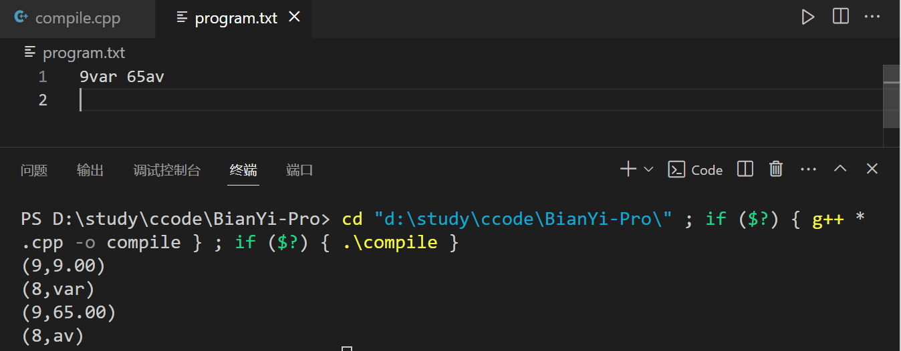
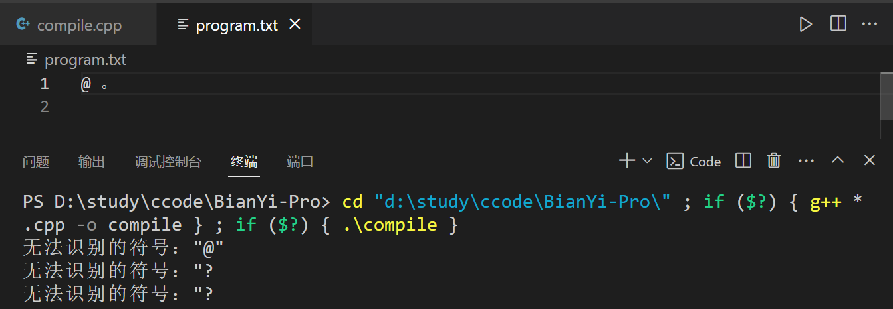
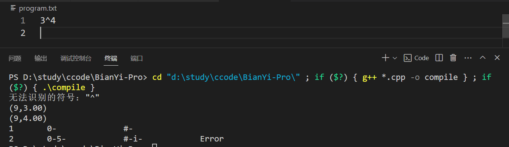

# 2023年秋季学期编译原理课程实验

[TOC]


##  一、实验设计

### 词法分析

#### 1.实验目的

​	通过编写和调试一个词法分析程序，掌握在对程序设计语言的源程序进行扫描的过程中，将字符流形式的源程序转化为一个由各类单词构成的序列的词法分析方法。

#### 2.实验要求

**输入：**由符合和不符合所规定的单词类别结构的**各类单词组成的源程序文件**。

**输出：**把所识别出的每一单词均按形如**（CLASS，VALUE）**的二元式形式输出，并将结果放到某个文件中。对于标识符和浮点常数，CLASS 字段为相应的类别码的助记符；VALUE 字段则是该标识符、常数的具体值；对于关键字和运算符，采用一词一类的编码形式，仅需在二元式的 CLASS 字段上放置相应单词的类别码的助记符，VALUE 字段则为“空”。

#### 3.具体设计内容

##### （1）单词分类码表

|  单词符号  |       助记符       | 类别编码 |        单词值        |
| :--------: | :----------------: | :------: | :------------------: |
|   begin    |       BEGIN        |    1     |                      |
|    end     |        END         |    2     |                      |
|     if     |         IF         |    3     |                      |
|    then    |        THEN        |    4     |                      |
|    else    |        ELSE        |    5     |                      |
|   while    |       WHILE        |    6     |                      |
|     do     |         DO         |    7     |                      |
|   标识符   |         ID         |    8     | 字母打头的字母数字串 |
|   整型数   |        INT         |    9     |    机内二进制表示    |
|     <      |         LT         |    10    |                      |
|     <=     |         LE         |    11    |                      |
|     ==     |         EQ         |    12    |                      |
|     <>     |         NE         |    13    |                      |
|     >      |         GT         |    14    |                      |
|     >      |         GE         |    15    |                      |
|     =      |         IS         |    16    |                      |
|     +      |         PL         |    17    |                      |
|     -      |         MI         |    18    |                      |
|     *      |         MU         |    19    |                      |
|     /      |         DI         |    20    |                      |
|   字符串   |        STR         |    21    |                      |
|   浮点型   |   FloatingPoint    |    22    |    机内二进制表示    |
| 科学计数型 | ScientificNotation |    23    |    机内二进制表示    |
|     （     |  leftParenthesis   |    24    |                      |
|     ）     |  RightParenthesis  |    25    |                      |
|     ；     |        SEM         |    26    |                      |
|     {      |     leftBrace      |    27    |                      |
|     }      |     rightBrace     |    28    |                      |
|  无符号数  |    UnsignedNum     |    30    |    机内二进制表示    |
|     #      |       pound        |   '#'    |                      |

**说明：**

- **表格中单词值为空**的项在二元式的value中为null
- **此表的建立并不是一开始就总体设计好的**：表格中类别编码中21-‘#’的符号为拓展实验以及因语法分析和语义分析中的需要后续补充的。

##### （2）状态转换图DFA


##### （3）数据结构

- **二元式**:**采用结构体存储**

  ```c++
  struct BinaryEquation
  {
      int Class;
      char *Value;
      double Num;
  };
  ```

  **说明：**

  - **value处使用两种类型变量**：由于不同的单词种类的value存储要求不同，比如标识符和整型等。

  - **存储空间浪费：**此处数据结构的设计其实并不合理。有的单词不需要空间value，有的单词只需要char*类型存储value，有的单词只需要double类型存储value。后续可以考虑使用c++的**共用体union**重构项目。

    > union，中文名“联合体、共用体”，在某种程度上类似结构体struct的一种数据结构，共用体(union)和结构体(struct)同样可以包含很多种数据类型和变量。但在“联合”中, 各成员共享一段内存空间, 一个联合变量的长度等于各成员中最长的长度 。一个联合体类型必须经过定义之后, 才能使用它，才能把一个变量声明定义为该联合体类型。

- **词法分析结果二元式序列：链表**

  ```c++
  list<BinaryEquation> wordsList;
  ```

  **说明：**

  - 此处可以也更换为C++STL库的动态数组**vector**数据结构

##### （4）设计思路

- **函数调用关系**

  

- **核心函数scanner_example()**：

  - 这个函数通过读取文件中的字符（`fgetc(fp)`）和当前状态（`state`），来决定如何处理每个字符。
  - 它使用了一个大型的`switch`语句，基于`CurrentState`来确定如何处理每个读取到的字符。

- **状态机**:

  - 状态机用于识别不同类型的tokens，如标识符、数字、操作符等。
  - 每个状态代表一个特定的识别过程，例如状态1用于构建标识符，状态3用于解析整数，状态5和7用于处理浮点数和科学记数法。

- **lookup函数**：

  **作用：**判断是否是关键字

  **实现：**构造一个关键字数组字典，进行查询

  ```c++
  const char *KeyWordTable[MAX_KEY_NUMBER] = {"begin", "end", "if", "then", "else", "while", "do", KEY_WORD_END};
  int lookup(char *token)
  {
      int n = 0;
      while (strcmp(KeyWordTable[n], KEY_WORD_END)) 
      {
          if (!strcmp(KeyWordTable[n], token)) 
          {
              return n + 1; 
              break;
          }
          n++;
      }
      return 0; 
  }
  ```

- **回溯机制**:

  当识别出一个完整的token后，代码会使用`fseek(fp, -1, SEEK_CUR)`回溯一个字符，以便下一次循环正确处理接下来的字符。

- **错误处理**:

  对于非法字符或序列进行错误处理，使用**report_error**函数。

- **注释处理：**

  - 如果**读取到`#`**，根据其位置（行首或行中）决定如何处理。如果在行首，就一直循环读直到文件末尾或者读到换行符；如果在行中，就进行错误处理。

  - **判断#是否在行首**

    构造函数IsCharacterAtLineBegin(FILE *fp)，首先判断文件指针是否在文件最前面，如果不在就继续判断当前指针的前的第二个字符是否是换行符，最后恢复原位置。

    ```c++
    int IsCharacterAtLineBegin(FILE *fp)
    { // 判断字符是否在行首
        // 判断是否在全文的首
        if (ftell(fp) == 1)
            return 1;
        fseek(fp, -2, 1);
        if (fgetc(fp) == '\n')
        {
            // 恢复原位置
            fseek(fp, 1, 1);
            return 1;
        }
        // 恢复原位置
        fseek(fp, 1, 1);
        return 0;
    }
    ```

- **数字和科学记数法的处理**:

  ​	在我们的词法分析过程中，所有数字都被当做char类型的字符处理，我们识别到的数字是字符数组形式的token。由于我们在单词表的设计中要求无符号数value的存储需要使用二进制存储，所以我们需要将token数组转换为double类型存储的数。**在本程序中，实现了在扫描的过程中，就进行字符串向数的转换，而不是已经生成了token数组后，再调用函数进行转换。**

  - **整型**

    我们在程序中引入了全局变量value1记录整型数字的值，每当扫描到数字就对value1进行更新。

    ```c++
    if (isdigit(ch))
    {
        ......
        value1 = value1 * 10 + (ch - '0');
    }
    ```

  - **浮点型**

    我们在程序中继续引入了全局变量value2、cnt和value3记录浮点数小数部分的值、小数位数和浮点数的值，此时value1就用来记录整数部分的值。每当扫描到小数点'.'后，就进行计数小数位数，并不断更新value2的值。最后让value3= value1+value2输出。

    ```c++
    cnt++;
    value2 = value2 + (ch - '0') * pow(10, -cnt);
    ```

  - **科学计数法**

    在前面的基础上引入全局变量value4来记录‘E’后面的值，也就是指数的值，思路和算法同整型。

- **输出**:

  - 使用`out`和`out_numValue`函数来输出识别的token或数值。

  - 在out函数中，将class和value的值存储在链表中，以out函数为例

    ```c++
    void out(int c, const char *value)
    {
        BinaryEquation data;
        data.Class = c;
        char *ch = (char *)malloc(sizeof(char) * MAX_WORD_LENGTH);
        strcpy(ch, value);
        data.Value = ch;
        wordsList.push_back(data);
    }
    ```

  - 构造printlist()函数，在命令行中输出单词二元式序列

    ```c++
    void printList()
    {
        for (auto it = wordsList.begin();it!=wordsList.end();it++) {
            if (it->Class!=INT&&it->Class!=FloatingPoint&&it->Class!=ScientificNotation)
                printf("(%d,%s)\n", it->Class, it->Value);
            else
                printf("(%d,%.2f)\n", it->Class, it->Num);
        }
    }
    ```

- **算法流程图**

  

  1. **初始化状态**：

     开始于状态0（`state = 0`），读取文件中的下一个字符。

  2. **字符类别判断**：

     根据读取的字符类型（字母、数字、特殊符号等）转移到不同的状态。

  3. **构建TOKEN**：

     在识别到标识符或数字的过程中，逐字符构建TOKEN字符串。

  4. **状态转移**：

     根据当前状态和读取的字符，决定下一个状态。例如，在状态1中，如果读到字母或数字则保持在状态1，否则转移到状态2进行TOKEN的确认。

  5. **TOKEN识别和输出**：

     在达到一个token的结束时（例如，在状态2中），对TOKEN进行分类（如关键字、标识符、数字等），然后输出。

  6. **错误处理**：

     遇到无法识别的字符或组合时，进行错误报告。

  7. **特殊情况处理**：

     如处理注释（`#`开头的行）或识别多字符符号（如`<=`）。

  8. **循环处理**：

     继续读取下一个字符，重复上述过程，直到文件结束。

### 语法分析

#### 1.实验目的

​	任选一种有代表性的语法分析方法，如算符优先法、递归下降法、LL(1)、SLR(1)、LR(1)等，通过设计、编制、调试实现一个典型的语法分析程序，对实验一所得扫描器提供的单词序列进行语法检查和结构分析，实现并进一步掌握常用的语法分析方法。

#### 2.实验要求

选择对各种常见高级程序设计语言都较为通用的语法结构作为分析对象，设计并实现一个语法分析程序。

**输入：**由实验一输出的单词串，例如：UCON，PL，UCON，MU，ID ······

**输出：**若输入源程序中的符号串是给定文法的句子，则输出“RIGHT”，并且给出每一步分析过程；若不是句子，即输入串有错误，则输出“ERROR”，并且显示分析至此所得的中间结果，如分析栈、符号栈中的信息等，以及必要的出错说明信息。

#### 3.具体设计内容

##### LL1分析法—算术表达式语法分析

###### （1）LL(1)分析表


###### （2）数据结构

- **二元式**:**结构体**

- **词法分析结果二元式序列：链表**

  ```c++
  // 单词链表
  extern list<BinaryEquation> wordsList;
  ```

- **LL1分析表**：**元素类型为字符指针的二维数组**

  ```c++
  // LL1分析表
  char *form[7][8];
  
  void init_form()
  {
      for (int i = 0; i < 7; i++)
      {
          for (int j = 0; j < 8; j++)
          {
              form[i][j] = NULL;
          }
      }
      form[E][map1[UnsignedNum]] = "Te";
      form[E][map1[leftParenthesis]] = "Te";
      form[e][map1[PL]] = "ATe";
      form[e][map1[MI]] = "ATe";
      form[e][map1[RightParenthesis]] = "";
      form[e][map1[pound]] = "";
      form[T][map1[UnsignedNum]] = "Ft";
      form[T][map1[leftParenthesis]] = "Ft";
      form[t][map1[PL]] = "";
      form[t][map1[MI]] = "";
      form[t][map1[MU]] = "MFt";
      form[t][map1[DI]] = "MFt";
      form[t][map1[RightParenthesis]] = "";
      form[t][map1[pound]] = "";
      form[F][map1[UnsignedNum]] = "i";
      form[F][map1[leftParenthesis]] = "(E)";
      form[A][map1[PL]] = "+";
      form[A][map1[MI]] = "-";
      form[M][map1[MU]] = "*";
      form[M][map1[DI]] = "/";
  }
  ```

- **分析栈：c++STL库栈，元素类型为int**

  ```c++
  // 分析栈
  stack<int> myStack;
  ```

- **map表**：**CLASS值和字符值向相应的表的索引位置的映射**

  ```c++
  // map1
  int map1[120];
  
  void init_map1()
  {
      // ????form????????
      map1[UnsignedNum] = 0;
      map1[PL] = 1;
      map1[MI] = 2;
      map1[MU] = 3;
      map1[DI] = 4;
      map1[leftParenthesis] = 5;
      map1[RightParenthesis] = 6;
      map1[pound] = 7;
      // form???????????????
      map1['E'] = E;
      map1['e'] = e;
      map1['T'] = T;
      map1['t'] = t;
      map1['F'] = F;
      map1['A'] = A;
      map1['M'] = M;
      map1['i'] = UnsignedNum;
      map1['+'] = PL;
      map1['-'] = MI;
      map1['*'] = MU;
      map1['/'] = DI;
      map1['('] = leftParenthesis;
      map1[')'] = RightParenthesis;
  }
  ```

###### （3）设计思路

- **函数调用关系**：

  

- **初始化函数**

  1. **init_map1**:
     - 初始化`map1`数组，将终结符和非终结符映射到特定的整数值。
     - 例如，`map1['E'] = E;` 将字符`'E'`映射到非终结符`E`的整数值。
  2. **init_form**:
     - 初始化LL(1)分析表`form`。
     - `form`是一个二维数组，用于根据当前的非终结符（如`E`、`T`、`F`等）和下一个输入符号来确定使用的产生式。
     - 例如，`form[E][map1[UnsignedNum]] = "Te";` 表示当当前符号是`E`且下一个输入符号是无符号数时，应用产生式`E -> Te`。

- **LL1分析器**

  1. **栈操作**:
     - 使用栈`myStack`来存储待处理的符号。
     - 初始时，栈中放入特殊符号`pound`（表示输入结束）和起始符号`E`。
  2. **处理输入**:
     - 从`wordsList`（单词链表）中读取输入的单词或符号。
     - `wordsList`可能是经过词法分析器处理后的结果，其中包含了源代码中的单词和符号。
  3. **分析过程**:
     - 循环检查栈顶符号（`xm`）和当前输入符号（`ai`）。
     - 如果`xm`是终结符且与`ai`相等，则从栈中弹出并读取下一个输入符号。
     - 如果`xm`不是终结符，根据`form`表中的产生式将其替换为一系列符号并入栈。
     - 特殊处理：整型、浮点型、科学计数法统一视为无符号数。
  4. **错误处理**:
     - 如果在`form`表中找不到合适的产生式，打印错误信息并结束。
  5. **结束条件**:
     - 当栈顶和输入符号都是`pound`时，分析结束，打印成功信息。

- **辅助函数**

  1. **isEndSymbol**:判断一个符号是否是终结符。

     ```c++
     //判断是否是终结符
     int isEndSymbol(int ch)
     {
         return ch == PL || ch == MI || ch == MU || ch == DI || ch == UnsignedNum ||
                ch == leftParenthesis || ch == RightParenthesis || ch == pound;
     }
     ```

  2. **StrReversePush**:将字符串中的符号以相反顺序推入栈中，在LL(1)分析中，我们从右到左替换产生式的右侧。

     ```c++
     // 字符串反向入栈
     void StrReversePush(stack<int> &myStack, char *str)
     {
         int cnt = strlen(str);
         while (cnt > 0)
         {
             // push(myStack, map1[str[cnt - 1]]);
             myStack.push(map1[str[cnt - 1]]);
             cnt--;
         }
     }
     ```

- **算法流程图**

  

  

##### SLR1分析法—算术表达式语法分析

###### （1）算术表达式文法

| 序号 | 产生式 |
| ---- | ------ |
| 1    | S->E   |
| 2    | E->E+T |
| 3    | E->E-T |
| 4    | E->T   |
| 5    | T->T*F |
| 6    | T->T/F |
| 7    | T->F   |
| 8    | F->(E) |
| 9    | F->i   |

###### （2）算术表达式文法的非终结符的FOLLOW集

| 非终结符 | FOLLOW集           |
| -------- | ------------------ |
| E        | {#，)，+，-}       |
| T        | {#，)，+，-，*，/} |
| F        | {#，)，+，-，*，/} |

###### （3）算术表达式的SLR1分析表

|      | UnsignedNum | PL   | MI   | MU   | DI   | leftParenthesis | RightParenthesis | pound | E    | T    | F    | A    | M    |
| ---- | ----------- | ---- | ---- | ---- | ---- | --------------- | ---------------- | ----- | ---- | ---- | ---- | ---- | ---- |
| 0    | s5          |      |      |      |      | s4              |                  |       | 1    | 2    | 3    |      |      |
| 1    |             |      |      |      |      |                 |                  | acc   |      |      |      |      |      |
| 2    |             | r2   | r2   | s10  | s11  |                 |                  | r2    |      |      |      |      | 9    |
| 3    |             |      |      | r4   | r4   |                 |                  | r4    |      |      |      |      |      |
| 4    | s5          |      |      |      |      | s4              |                  |       | 12   | 2    | 3    |      |      |
| 5    |             |      |      |      |      |                 |                  | r6    |      |      |      |      |      |
| 6    | s5          |      |      |      |      | s4              |                  |       |      | 13   | 3    |      |      |
| 7    | r7          |      |      |      |      | r7              |                  |       |      |      |      |      |      |
| 8    | r8          |      |      |      |      | r8              |                  |       |      |      |      |      |      |
| 9    | s5          |      |      |      |      | s4              |                  |       |      |      | 14   |      |      |
| 10   | r9          |      |      |      |      | r9              |                  |       |      |      |      |      |      |
| 11   | r10         |      |      |      |      | r10             |                  |       |      |      |      |      |      |
| 12   |             | s7   | s8   |      |      |                 | 15               |       |      |      |      | 6    |      |
| 13   |             |      |      | s10  | s11  |                 |                  |       |      |      |      |      | 9    |
| 14   |             |      |      | r3   | r3   |                 |                  | r3    |      |      |      |      |      |
| 15   |             |      |      |      |      |                 |                  | r5    |      |      |      |      |      |

###### （4）数据结构
- **二元式**:**结构体**

- **词法分析结果二元式序列：链表**

- **文法产生式：结构体**

  ```c++
  /* 文法产生式 */
  struct Production
  {
    char left;
    string right;
  };
  ```

- **文法**：**元素类型为Production的动态数组**

  ```c++
  vector<Production> Grammars;
  ```

- **SLR1文法分析表：元素类型为string的二维数组**

  ```c++
  //SLR1文法分析表
  string form[100][100];
  
   void init_form()
   {
       //initGrammarFromFile(form, rows, columns);
       for (int i = 0; i < 16; i++)
       {
           for (int j = 0; j < 11; j++)
           {
               form[i][j] = "";
           }
       }
       form[0][0] = "s4";
       form[0][6] = "s5";
       form[0][8] = "g1";
       form[0][9] = "g2";
       form[0][10] = "g3";
  
       form[1][2] = "s6";
       form[1][3] = "s7";
       form[1][7] = "acc";
  
       form[2][1] = "r3";
       form[2][2] = "r3";
       form[2][3] = "r3";
       form[2][4] = "s8";
       form[2][5] = "s9";
       form[2][7] = "r3";
  
       form[3][1] = "r6";
       form[3][2] = "r6";
       form[3][3] = "r6";
       form[3][4] = "r6";
       form[3][5] = "r6";
       form[3][7] = "r6";
  
       form[4][0] = "s4";
       form[4][6] = "s5";
       form[4][8] = "g10";
       form[4][9] = "g2";
       form[4][10] = "g3";
  
       form[5][1] = "r8";
       form[5][2] = "r8";
       form[5][3] = "r8";
       form[5][4] = "r8";
       form[5][5] = "r8";
       form[5][7] = "r8";
  
       form[6][0] = "s4";
       form[6][6] = "s5";
       form[6][9] = "g11";
       form[6][10] = "g3";
  
       form[7][0] = "s4";
       form[7][6] = "s5";
       form[7][9] = "g12";
       form[7][10] = "g3";
  
       form[8][0] = "s4";
       form[8][6] = "s5";
       form[8][10] = "g13";
  
       form[9][0] = "s4";
       form[9][6] = "s5";
       form[9][10] = "g14";
  
       form[10][1] = "s15";
       form[10][2] = "s6";
       form[10][3] = "s7";
  
       form[11][1] = "r1";
       form[11][2] = "r1";
       form[11][3] = "r1";
       form[11][4] = "s8";
       form[11][5] = "s9";
       form[11][7] = "r1";
  
       form[12][1] = "r2";
       form[12][2] = "r2";
       form[12][3] = "r2";
       form[12][4] = "s8";
       form[12][5] = "s9";
       form[12][7] = "r2";
  
       form[13][1] = "r4";
       form[13][2] = "r4";
       form[13][3] = "r4";
       form[13][4] = "r4";
       form[13][5] = "r4";
       form[13][7] = "r4";
  
       form[14][1] = "r5";
       form[14][2] = "r5";
       form[14][3] = "r5";
       form[14][4] = "r5";
       form[14][5] = "r5";
       form[14][7] = "r5";
  
       form[15][1] = "r7";
       form[15][2] = "r7";
       form[15][3] = "r7";
       form[15][4] = "r7";
       form[15][5] = "r7";
       form[15][7] = "r7";
   }
  ```

- **单词链表的class向列index的映射**：**map数组**

  ```c++
  // 单词链表的class向列index的映射
  int map1[100];
  void init_map1()
  {
      map1[leftParenthesis] = 0;
      map1[RightParenthesis] = 1;
      map1[PL] = 2;
      map1[MI] = 3;
      map1[MU] = 4;
      map1[DI] = 5;
      map1[UnsignedNum] = 6;
      map1[INT] = 6;
      map1[FloatingPoint] = 6;
      map1[ScientificNotation] = 6;
      map1[pound] = 7;
  }
  ```

- **非终结符的字符向列index的映射**：**map数组**

  ```c++
  #define E 8
  #define T 9
  #define F 10
  void init_map2()
  {
      map2['E'] = E;
      map2['T'] = T;
      map2['F'] = F;
  }
  ```

- **实现分析过程可视化需要输出栈，将int类型的class转换为字符型输出：map数组**

  ```c++
  // 实现分析过程可视化需要输出栈，将int类型的class转换为字符型输出
  int map3[100];
  void init_map3()
  {
      map3[pound] = '#';
      map3[leftParenthesis] = '(';
      map3[RightParenthesis] = ')';
      map3[PL] = '+';
      map3[MI] = '-';
      map3[MU] = '*';
      map3[DI] = '/';
      map3[UnsignedNum] = 'i';
      map3[INT] = 'i';
      map3[FloatingPoint] = 'i';
      map3[ScientificNotation] = 'i';
  }
  ```

- **语法分析的状态栈、符号栈：自定义栈结构**

  ```c++
  typedef struct
  {
    int *items;
    int top;
  } Stack;
  
  // 状态栈
  Stack StateStack;
  // 符号栈
  Stack SymbolStack;
  ```

  **说明：**

  ​	*此处没有使用C++STL库中的栈结构是因为本程序中实现的分析过程可视化需要输出栈结构，但c++标准库的栈没有提供相应方法和函数进行遍历，于是自己写了一个简单的栈结构和常用的方法库进行调用。*

  **stack.h**

  ```c++
  #ifndef STACK_H
  #define STACK_H
  
  typedef struct
  {
      int *items;
      int top;
  } Stack;
  
  void initialize(Stack *stack);
  int isEmpty(Stack *stack);
  void push(Stack *stack, int value);
  int pop(Stack *stack);
  int peek_stack(Stack *stack);
  
  #endif /* STACK_OPERATIONS_H */
  ```

  **stack.cpp**

  具体实现部分见实验报告源代码部分

###### （5）设计思路

- **函数调用关系**

  

- **初始化函数**

  1. **`init_map1`、`init_map2`、`init_map3`**:
     - 初始化映射表。(具体功能作用在数据结构部分)
  2. **`init_form`**:
     - 初始化SLR(1)分析表。

- **SLR(1)分析过程**

  1. **初始化**:
     - 初始化状态和符号栈，压入初始状态和结束标记。
  2. **分析循环**:
     - 遍历单词链表，使用SLR(1)分析表进行语法分析。
  3. **解析动作**:
     - 根据当前状态和输入符号从分析表中获取动作（移入's'或规约'r'）和新状态。
  4. **移入操作**:
     - 当动作是移入时，将符号和新状态压入相应栈。
  5. **规约操作**:
     - 当动作是规约时，根据产生式右侧的长度弹出符号栈和状态栈的元素，然后将产生式左侧的非终结符压入符号栈。接着根据新的栈顶符号和状态查找并执行下一个动作。
  6. **结束判断**:
     - 如果从分析表中获取的动作为空或特殊标记（如'acc'），则分析过程结束。

- **辅助函数**

  1. **traverseStack**:**遍历并打印栈的内容。**

     ```c++
     void traverseStack(Stack *stack,bool isSymbol)
     {
         if (isEmpty(stack))
         {
             printf("栈为空,遍历终止\n");
             return;
         }
         for (int i = 0; i <= stack->top; i++)
         {
             if (isSymbol)
                 printf("%c-", map3[stack->items[i]]);
             else
                 printf("%d-", stack->items[i]);
         }
     }
     ```

  2. **Split:解析分析表中的项，分离动作和状态。**

     ```c++
     void Split(string str, char *action, int *state)
     {
         *action = str[0];
         *state = atoi(&str[1]);
     }
     ```

- **算法流程图**

  

  1. **初始化**：
     - 初始化状态栈和符号栈，将初始状态和结束标记压入栈。
  2. **读取输入**：
     - 从单词链表中读取下一个输入符号。
  3. **获取动作和状态**：
     - 根据状态栈的栈顶元素和输入符号从SLR(1)分析表中获取动作和状态。
  4. **判断动作**：
     - 如果动作是移入（s），进行移入操作。
     - 如果动作是规约（r），进行规约操作。
     - 如果动作为空或特殊标记（如'accept'），则结束分析。
  5. **移入操作**：
     - 将输入符号和新状态分别压入符号栈和状态栈。
  6. **规约操作**：
     - 根据规约产生式的右侧长度，从栈中弹出相应数量的符号和状态。
     - 将产生式左侧的非终结符压入符号栈。
     - 使用新的栈顶符号和状态再次查找分析表以获取下一个状态，并将其压入状态栈。
  7. **重复过程**：
     - 重复以上步骤，直到遇到结束标记或无法进行下一步动作。

##### （拓展）SLR1分析法—拓展文法语法分析

​	在 算术表达式的基础上进一步选择高级语言中的赋值语句、复合语句、流程控制语句等语法结构作为语法分析对象。

###### （1）拓展文法

| 序号 | 文法产生式 | 备注               |
| ---- | ---------- | ------------------ |
| 1    | P->S       |                    |
| 2    | S->A       |                    |
| 3    | S->SA      |                    |
| 4    | A->B       |                    |
| 5    | A->C       |                    |
| 6    | A->D       |                    |
| 7    | B->f(K){S} | if(){} 分支语句    |
| 8    | C->w(K){S} | while(){} 循环语句 |
| 9    | D->d=E;    | 赋值语句           |
| 10   | K->E       |                    |
| 11   | K->G       |                    |
| 12   | G->E<E     |                    |
| 13   | G->E>E     |                    |
| 14   | E->E+T     |                    |
| 15   | E->E-T     |                    |
| 16   | E->T       |                    |
| 17   | T->T*F     |                    |
| 18   | T->T/F     |                    |
| 19   | T->F       |                    |
| 20   | F->(E)     |                    |
| 21   | F->i       | i为无符号数        |
| 22   | F->d       | d为标识符          |

**非终结符 ：** P S A B C D G K E T F

**终结符：**f w ( ) { } d = ; < > i + - * /

**说明：**

- 此文法包含了if分支语句，while循环语句，赋值语句，算术表达式，并且可以实现嵌套。

###### （2）拓展文法的非终结符的FIRST集和FOLLOW集

| 非终结符 | FIRST集 | FOLLOW集        |
| -------- | ------- | --------------- |
| P        | d f w   | #               |
| S        | d f w   | # d f w }       |
| A        | d f w   | # d f w }       |
| B        | f       | # d f w }       |
| C        | w       | # d f w }       |
| D        | d       | # d f w }       |
| G        | ( d i   | )               |
| K        | ( d i   | )               |
| E        | ( d i   | ) + - ; < >     |
| T        | ( d i   | ) * + - / ; < > |
| F        | ( d i   | ) * + - / ; < > |

###### （3）拓展文法的状态转换图


###### （4）拓展文法的SLR1分析表

|      | f    | w    | (    | )    | {    | }    | d    | =    | ;    | <    | >    | i    | +    | -    | *    | /    | $    | S    | A    | B    | C    | D    | G    | K    | E    | T    | F    |
| ---- | ---- | ---- | ---- | ---- | ---- | ---- | ---- | ---- | ---- | ---- | ---- | ---- | ---- | ---- | ---- | ---- | ---- | ---- | ---- | ---- | ---- | ---- | ---- | ---- | ---- | ---- | ---- |
| 0    | s1   | s2   |      |      |      |      | s3   |      |      |      |      |      |      |      |      |      |      | g4   | g5   | g6   | g7   | g8   |      |      |      |      |      |
| 1    |      |      | s9   |      |      |      |      |      |      |      |      |      |      |      |      |      |      |      |      |      |      |      |      |      |      |      |      |
| 2    |      |      | s10  |      |      |      |      |      |      |      |      |      |      |      |      |      |      |      |      |      |      |      |      |      |      |      |      |
| 3    |      |      |      |      |      |      |      | s11  |      |      |      |      |      |      |      |      |      |      |      |      |      |      |      |      |      |      |      |
| 4    | s1   | s2   |      |      |      |      | s3   |      |      |      |      |      |      |      |      |      | acc  |      | g12  | g6   | g7   | g8   |      |      |      |      |      |
| 5    | r1   | r1   |      |      |      | r1   | r1   |      |      |      |      |      |      |      |      |      | r1   |      |      |      |      |      |      |      |      |      |      |
| 6    | r3   | r3   |      |      |      | r3   | r3   |      |      |      |      |      |      |      |      |      | r3   |      |      |      |      |      |      |      |      |      |      |
| 7    | r4   | r4   |      |      |      | r4   | r4   |      |      |      |      |      |      |      |      |      | r4   |      |      |      |      |      |      |      |      |      |      |
| 8    | r5   | r5   |      |      |      | r5   | r5   |      |      |      |      |      |      |      |      |      | r5   |      |      |      |      |      |      |      |      |      |      |
| 9    |      |      | s13  |      |      |      | s14  |      |      |      |      | s15  |      |      |      |      |      |      |      |      |      |      | g16  | g17  | g18  | g19  | g20  |
| 10   |      |      | s13  |      |      |      | s14  |      |      |      |      | s15  |      |      |      |      |      |      |      |      |      |      | g16  | g21  | g18  | g19  | g20  |
| 11   |      |      | s13  |      |      |      | s14  |      |      |      |      | s15  |      |      |      |      |      |      |      |      |      |      |      |      | g22  | g19  | g20  |
| 12   | r2   | r2   |      |      |      | r2   | r2   |      |      |      |      |      |      |      |      |      | r2   |      |      |      |      |      |      |      |      |      |      |
| 13   |      |      | s13  |      |      |      | s14  |      |      |      |      | s15  |      |      |      |      |      |      |      |      |      |      |      |      | g23  | g19  | g20  |
| 14   |      |      |      | r21  |      |      |      |      | r21  | r21  | r21  |      | r21  | r21  | r21  | r21  |      |      |      |      |      |      |      |      |      |      |      |
| 15   |      |      |      | r20  |      |      |      |      | r20  | r20  | r20  |      | r20  | r20  | r20  | r20  |      |      |      |      |      |      |      |      |      |      |      |
| 16   |      |      |      | r10  |      |      |      |      |      |      |      |      |      |      |      |      |      |      |      |      |      |      |      |      |      |      |      |
| 17   |      |      |      | s24  |      |      |      |      |      |      |      |      |      |      |      |      |      |      |      |      |      |      |      |      |      |      |      |
| 18   |      |      |      | r9   |      |      |      |      |      | s25  | s26  |      | s27  | s28  |      |      |      |      |      |      |      |      |      |      |      |      |      |
| 19   |      |      |      | r15  |      |      |      |      | r15  | r15  | r15  |      | r15  | r15  | s29  | s30  |      |      |      |      |      |      |      |      |      |      |      |
| 20   |      |      |      | r18  |      |      |      |      | r18  | r18  | r18  |      | r18  | r18  | r18  | r18  |      |      |      |      |      |      |      |      |      |      |      |
| 21   |      |      |      | s31  |      |      |      |      |      |      |      |      |      |      |      |      |      |      |      |      |      |      |      |      |      |      |      |
| 22   |      |      |      |      |      |      |      |      | s32  |      |      |      | s27  | s28  |      |      |      |      |      |      |      |      |      |      |      |      |      |
| 23   |      |      |      | s33  |      |      |      |      |      |      |      |      | s27  | s28  |      |      |      |      |      |      |      |      |      |      |      |      |      |
| 24   |      |      |      |      | s34  |      |      |      |      |      |      |      |      |      |      |      |      |      |      |      |      |      |      |      |      |      |      |
| 25   |      |      | s13  |      |      |      | s14  |      |      |      |      | s15  |      |      |      |      |      |      |      |      |      |      |      |      | g35  | g19  | g20  |
| 26   |      |      | s13  |      |      |      | s14  |      |      |      |      | s15  |      |      |      |      |      |      |      |      |      |      |      |      | g36  | g19  | g20  |
| 27   |      |      | s13  |      |      |      | s14  |      |      |      |      | s15  |      |      |      |      |      |      |      |      |      |      |      |      |      | g37  | g20  |
| 28   |      |      | s13  |      |      |      | s14  |      |      |      |      | s15  |      |      |      |      |      |      |      |      |      |      |      |      |      | g38  | g20  |
| 29   |      |      | s13  |      |      |      | s14  |      |      |      |      | s15  |      |      |      |      |      |      |      |      |      |      |      |      |      |      | g39  |
| 30   |      |      | s13  |      |      |      | s14  |      |      |      |      | s15  |      |      |      |      |      |      |      |      |      |      |      |      |      |      | g40  |
| 31   |      |      |      |      | s41  |      |      |      |      |      |      |      |      |      |      |      |      |      |      |      |      |      |      |      |      |      |      |
| 32   | r8   | r8   |      |      |      | r8   | r8   |      |      |      |      |      |      |      |      |      | r8   |      |      |      |      |      |      |      |      |      |      |
| 33   |      |      |      | r19  |      |      |      |      | r19  | r19  | r19  |      | r19  | r19  | r19  | r19  |      |      |      |      |      |      |      |      |      |      |      |
| 34   | s1   | s2   |      |      |      |      | s3   |      |      |      |      |      |      |      |      |      |      | g42  | g5   | g6   | g7   | g8   |      |      |      |      |      |
| 35   |      |      |      | r11  |      |      |      |      |      |      |      |      | s27  | s28  |      |      |      |      |      |      |      |      |      |      |      |      |      |
| 36   |      |      |      | r12  |      |      |      |      |      |      |      |      | s27  | s28  |      |      |      |      |      |      |      |      |      |      |      |      |      |
| 37   |      |      |      | r13  |      |      |      |      | r13  | r13  | r13  |      | r13  | r13  | s29  | s30  |      |      |      |      |      |      |      |      |      |      |      |
| 38   |      |      |      | r14  |      |      |      |      | r14  | r14  | r14  |      | r14  | r14  | s29  | s30  |      |      |      |      |      |      |      |      |      |      |      |
| 39   |      |      |      | r16  |      |      |      |      | r16  | r16  | r16  |      | r16  | r16  | r16  | r16  |      |      |      |      |      |      |      |      |      |      |      |
| 40   |      |      |      | r17  |      |      |      |      | r17  | r17  | r17  |      | r17  | r17  | r17  | r17  |      |      |      |      |      |      |      |      |      |      |      |
| 41   | s1   | s2   |      |      |      |      | s3   |      |      |      |      |      |      |      |      |      |      | g43  | g5   | g6   | g7   | g8   |      |      |      |      |      |
| 42   | s1   | s2   |      |      |      | s44  | s3   |      |      |      |      |      |      |      |      |      |      |      | g12  | g6   | g7   | g8   |      |      |      |      |      |
| 43   | s1   | s2   |      |      |      | s45  | s3   |      |      |      |      |      |      |      |      |      |      |      | g12  | g6   | g7   | g8   |      |      |      |      |      |
| 44   | r6   | r6   |      |      |      | r6   | r6   |      |      |      |      |      |      |      |      |      | r6   |      |      |      |      |      |      |      |      |      |      |
| 45   | r7   | r7   |      |      |      | r7   | r7   |      |      |      |      |      |      |      |      |      | r7   |      |      |      |      |      |      |      |      |      |      |


###### **（5）数据结构**

*同上文的算术表达式的数据结构设计*

###### （6）设计思路

- 函数调用关系

  

  **与算术表达式相比，多了一个initform函数**，使用新的方式构造SLR1表。

- 算法整体设计思路和流程分析与算术表达式的SLR1分析相同，此处不在赘述。

- **从CSV文件中读取SLR1表：**

  - 由于拓展文法构造的SLR1分析表过大，如果仍按照算数表达式的SLR1表的构造方式，表的录入过于繁琐，且可读性差。此处尝试在**excel**中填写构造的SLR1表，将**xlsx文件转换为csv文件**，构造函数进行对SLR1表进行读取。

  - ```c++
    // 将CSV文件内容读取并保存到二维字符串数组中
    void initForm(const string& filename) {
        // 打开文件
        ifstream file(filename);
        // 检查文件是否成功打开
        if (!file.is_open()) {
            cerr << "Error opening file." << endl;
            return ;
        }
        string line;
        // 逐行读取文件内容
        while (getline(file, line)) {
            // 存储单行数据的字符串向量
            vector<string> row;
            stringstream lineStream(line);
            string cell;
            // 使用逗号分隔符分割行内容，提取每个单元格数据
            while (getline(lineStream, cell, ',')) { // 假设逗号是分隔符
                row.push_back(cell);                 // 将单元格数据添加到行向量中
            }
            form.push_back(row); // 将行向量添加到二维向量中
        }
        file.close();
    }
    ```

- **从TXT文件中读取文法**

  - 原因同上

  - ```c++
    void initGrammar()
    {
        ifstream inputFile("grammar.txt");
        int num;
        inputFile >> num;
        string s;
        Production temp;
        for (int i = 0; i < num; i++)
        {
            inputFile >> s;
            temp.left=s[0];
            temp.right = s.substr(3);
            Grammars.push_back(temp);
        }
    }
    ```

- 前面两种从文件读取的方法虽然增加了程序可读性，也方便了文法和分析表的修改。但此种方法会**降低效率**，深入开发编译器时需全局考虑。

### 语义分析

#### 1.实验目的

​	在实现词法、语法分析程序的基础上，编写相应的语义子程序，进行语义处理，加深对语法制导翻译原理的理解，进一步掌握将语法分析所识别的语法范畴变换为某种中间代码（四元式）的语义分析方法，并完成相关语义分析器的代码开发。

#### 2.实验要求

​	对文法 G2[<算术表达式>]中的产生式添加语义处理子程序，完成运算对象是简单变量（标识符）和无符号数的四则运算的计值处理，将输入的四则运算转换为四元式形式的中间代码。

**输入：**包含测试用例（由标识符、无符号数和+、−、*、/、(、)构成的算术表达式）的源程序文件。

**输出：**将源程序转换为中间代码形式表示，并将中间代码序列输出到文件中。若源程序中有错误，应指出错误信息。

#### 3.具体设计内容

##### （1）语义子程序设计

| 序号 | 文法产生式      | 语义子程序                                                   |
| ---- | --------------- | ------------------------------------------------------------ |
| 1    | S->A            | { }                                                          |
| 2    | E(1) -> E(2) +T | {E(1) .PLACE:=Newtemp（）；<br />GEN(‘+’, E(2）.PLACE,T.PLACE,E(1) .PLACE)；} |
| 3    | E(1) -> E(2) -T | {E(1) .PLACE:=Newtemp（）；<br />GEN(‘-’, E(2）.PLACE,T.PLACE,E(1) .PLACE)；} |
| 4    | E->T            | E.PLACE=T.PLACE                                              |
| 5    | T(1) ->T(2)*F   | {T(1) .PLACE:=Newtemp（）;<br />GEN(‘*’, T(2）.PLACE,F.PLACE,T(1) .PLACE)} |
| 6    | T(1) ->T(2)*F   | {T(1) .PLACE:=Newtemp（）;<br />GEN(‘/’, T(2）.PLACE,F.PLACE,T(1) .PLACE)} |
| 7    | T->F            | {T.PLACE:=F.PLACE}                                           |
| 8    | F->(E)          | {F.PLACE:=E.PLACE}                                           |
| 9    | F->i            | {F.PLACE:=ENTRY(i)}                                          |

##### （2）数据结构

- **非终结符的语义属性：map表**

  ```c++
  map<char, BinaryEquation *> PlaceMap;
  ```

  从上方map的定义可以看出，map的key为char类型，正好对应文法产生式的左部也是char类型；map的value为实验一中定义的二元式结构体的指针类型。

- **文法**：**元素类型为Production的动态数组**

  ```c++
  vector<Production> Grammars;
  ```

- **四元式**：**结构体表示**

  ```c++
  struct Quaternion
  {
      char op;
      BinaryEquation *arg1;
      BinaryEquation *arg2;
      BinaryEquation *result;
  };
  ```

  第一、第二操作数和结果的类型均使用词法分析二元式结构体的指针类型

- **中间代码：元素类型为Quaternion的动态数组**

  ```c++
  //中间代码
  vector<Quaternion> IntermediateCode;
  ```

##### （3）设计思路

- **函数调用关系**

  

- **语义分析函数 execute：**

  根据传入的 `index` 执行不同的操作，如生成新的四元组、更新 `PlaceMap` 映射等。`PlaceMap` 是一个外部映射，将字符映射到 `BinaryEquation` 指针。

  ```c++
  switch (index)
  {
      case 0:
          break;
      case 1:
          temp = NewTemp();
          q_new = Gen('+', PlaceMap['E'], PlaceMap['T'], temp);
          PlaceMap['E'] = temp;
          break;
      case 2:
          temp = NewTemp();
          q_new = Gen('-', PlaceMap['E'], PlaceMap['T'], temp);
          PlaceMap['E'] = temp;
          cout << "生成" << temp->Value << ",生成四元式";
          printQuaternion(q_new);
          break;
      case 3:
          PlaceMap['E'] = PlaceMap['T'];
          cout << "E.Place=" << *(PlaceMap['T']);
          //printQuaternion(q_new);
          break;
      case 4:
          temp = NewTemp();
          q_new = Gen('*', PlaceMap['T'], PlaceMap['F'], temp);
          PlaceMap['T'] = temp;
          cout << "生成" << temp->Value << ",生成四元式";
          printQuaternion(q_new);
          break;
      case 5:
          temp = NewTemp();
          q_new = Gen('/', PlaceMap['T'], PlaceMap['F'], temp);
          PlaceMap['T'] = temp;
          cout << "生成" << temp->Value << ",生成四元式";
          printQuaternion(q_new);
          break;
      case 6:
          PlaceMap['T'] = PlaceMap['F'];
          cout << "T.Place=" << *(PlaceMap['F']);
          break;
      case 7:
          PlaceMap['F'] = PlaceMap['E'];
          cout << "F.Place=" << *(PlaceMap['E']);
          break;
      case 8 :
          PlaceMap['F'] = i;
          cout << "F.Place=" << *i;
          break;
      default:
          printf("error\n");
          return;
      break;
  }
  ```

- **非终结符的语义属性：**

  在此文法分析的过程中，我们引入了一个**place语义属性**。对于place这个语义属性的处理，我们利用了实验一词法分析生成的单词二元式链表，并且**维护了一个map**，`map<char, BinaryEquation *> PlaceMap`,即把**place变成二元式结构体指针**，所以语义的传递就变成了指针的传递，起到类似‘符号表’的作用。

- **重载 `<<` 运算符：**

  此处尝试使用C++的重载功能，用于打印 `BinaryEquation` 结构体对象。根据 `BinaryEquation` 的 `Class` 成员变量（如 `INT`, `FloatingPoint`, `ScientificNotation`, `UnsignedNum` 等），输出不同类型的值。

  目的在于减少了printQuaternion和printIntermediateCode的大量逻辑判断。

  ```c++
  ostream &operator<<(ostream &os, const BinaryEquation &binaryEquation)
  {
      if (binaryEquation.Class == INT || binaryEquation.Class == FloatingPoint || binaryEquation.Class == ScientificNotation || binaryEquation.Class == UnsignedNum)
          os << binaryEquation.Num;
      else
          os << binaryEquation.Value;
      return os;
  }
  ```

- **算法流程**

  和语法分析在一起显示

  

  1. **初始化**：
     - 初始化状态栈和符号栈，将初始状态和结束标记压入栈。
  2. **读取输入**：
     - 从单词链表中读取下一个输入符号。
  3. **获取动作和状态**：
     - 根据状态栈的栈顶元素和输入符号从SLR(1)分析表中获取动作和状态。
  4. **判断动作**：
     - 如果动作是移入（s），进行移入操作。
     - 如果动作是规约（r），进行规约操作。
     - 如果动作为空或特殊标记（如'accept'），则结束分析。
  5. **移入操作**：
     - 将输入符号和新状态分别压入符号栈和状态栈。
  6. **规约操作**：
     - 根据规约产生式的右侧长度，从栈中弹出相应数量的符号和状态。
     - 将产生式左侧的非终结符压入符号栈。
     - 使用新的栈顶符号和状态再次查找分析表以获取下一个状态，并将其压入状态栈。
     - ***语义处理：调用excute()函数进行语义处理，执行相应的文法产生式的语义处理子程序***
  7. **重复过程**：
     - 重复以上步骤，直到遇到结束标记或无法进行下一步动作。

## 二、程序代码

**编程工具**：vscode

**编译器**：mingw

**编程语言**：主要为C++，其中有一些C风格的代码是因为参考了指导书的示例。

- **头文件compile.h**

  ```c++
  #ifndef FILENAME_H
  #define FILENAME_H
  
  #include <iostream>
  #include <cstring>
  #include <cmath>
  #include <cstdio>
  #include <vector>
  #include <string>
  #include <map>
  #include <stack>
  #include <queue>
  #include <fstream>
  #include<list>
  #include <set>
  
  using namespace std;
  //词法分析的单词序列
  struct BinaryEquation
  {
      int Class;
      char *Value;
      double Num;
  };
  
  /* 文法产生式 */
  struct Production
  {
      char left;
      string right;
  };
  
  #define BEGIN 1
  #define END 2
  #define IF 3
  #define THEN 4
  #define ELSE 5
  #define WHILE 6
  #define DO 7
  #define ID 8 //标识符
  #define INT 9 //整型
  #define LT 10 // <
  #define LE 11 // <=
  #define EQ 12// ==
  #define NE 13// <>
  #define GT 14// >
  #define GE 15// >=
  #define IS 16// =
  #define PL 17// +
  #define MI 18// -
  #define MU 19// *
  #define DI 20// /
  #define STR 21// 字符串str
  #define FloatingPoint 22 //浮点型
  #define ScientificNotation 23 //科学计数法
  #define leftParenthesis 24 //左括号
  #define RightParenthesis 25 //右括号
  #define SEM 26 // ;
  #define leftBrace 27 // {
  #define rightBrace 28 // }
  #define UnsignedNum 30 //无符号数
  #define TempVariable 31//临时变量(语义分析使用)
  #define pound '#' //#
  
  #define MAX_WORD_LENGTH 20
  #endif // FILENAME_H
  ```

- **自定义栈库：stack.h**

  ```c++
  #ifndef STACK_H
  #define STACK_H
  
  typedef struct
  {
      int *items;
      int top;
  } Stack;
  
  void initialize(Stack *stack);
  int isEmpty(Stack *stack);
  void push(Stack *stack, int value);
  int pop(Stack *stack);
  int peek_stack(Stack *stack);
  
  #endif /* STACK_OPERATIONS_H */
  ```

- **stack.h库的函数实现：stack.cpp**

  ```c++
  #include<iostream>
  #include "stack.h" 
  
  // 初始化栈
  void initialize(Stack *stack)
  {
      stack->top = -1;
      stack->items = NULL;
  }
  
  // 判断栈是否为空
  int isEmpty(Stack *stack)
  {
      return stack->top == -1;
  }
  
  // 入栈操作
  void push(Stack *stack, int value)
  {
      stack->top++;
  
      // 动态分配内存，每次扩展栈大小
      stack->items = (int *)realloc(stack->items, (stack->top + 1) * sizeof(int *));
  
      if (stack->items == NULL)
      {
          printf("内存分配失败\n");
          exit(EXIT_FAILURE);
      }
      stack->items[stack->top] = value;
      // printf("%c 入栈成功\n", value);
  }
  
  // 出栈操作
  int pop(Stack *stack)
  {
      if (isEmpty(stack))
      {
          printf("栈为空，无法出栈\n");
          return -1; // 表示出栈失败
      }
      else
      {
          int poppedItem = stack->items[stack->top];
          stack->top--;
  
          // 动态缩小内存，每次缩小一个元素
          stack->items = (int *)realloc(stack->items, (stack->top + 1) * sizeof(int *));
  
          // printf("%d 出栈成功\n", poppedItem);
          return poppedItem;
      }
  }
  
  // 获取栈顶元素
  int peek_stack(Stack *stack)
  {
      if (isEmpty(stack))
      {
          printf("栈为空\n");
          return -1; // 表示栈为空
      }
      else
      {
          return stack->items[stack->top];
      }
  }
  ```

- **main函数入口：compile.cpp**

  ```c++
  #include"compile.h"    //必写，其实就是c的#include <stdio.h>
  
  extern int CurrentState;
  extern int Index;
  extern void scanner_example(FILE *fp, int state, int *index);
  extern void printList();
  void printIntermediateCode();
  extern list<BinaryEquation> wordsList;
  extern void LL1();
  extern void SLR1();
  
  void Compile(FILE *fp)
  {
      char ch;
      while ((ch = fgetc(fp)) != EOF)
      {
          fseek(fp, -1, 1);
          scanner_example(fp, CurrentState, &Index);
      }
  }
  
  int main()
  {
      FILE *fp = fopen("program.txt", "r");//读取目录下的program程序文件
      Compile(fp);
      printList();//打印词法分析结果
      //LL1();
      SLR1();
      printIntermediateCode();//打印中间代码
      return 0;
  }
  ```

- **词法分析：scanner.cpp**

  ```c++
  #include"compile.h"
  
  int CurrentState = 0;
  int Index = 0;
  double value1;
  double value2;
  double value3;
  double value4;
  double value;
  int flag = 1;
  int cnt = 0;
  
  char TOKEN[20];
  
  extern void out(int, const char *);
  extern void out_numValue(int, double);
  extern int report_error(char);
  extern int report_error2(char *);
  extern int lookup(char *);
  
  int IsCharacterAtLineBegin(FILE *fp)
  { // 判断字符是否在行首
      // 判断是否在全文的首
      if (ftell(fp) == 1)
          return 1;
      fseek(fp, -2, 1);
      if (fgetc(fp) == '\n')
      {
          // 恢复原位置
          fseek(fp, 1, 1);
          return 1;
      }
      // 恢复原位置
      fseek(fp, 1, 1);
      return 0;
  }
  
  void scanner_example(FILE *fp, int state, int *index)
  {
      char ch;
      int c;
      ch = fgetc(fp);
      switch (state)
      {
      case 0:
          if (isalpha(ch))
          {
              TOKEN[*index] = ch;
              (*index)++;
              CurrentState = 1;
          }
          else if (isdigit(ch))
          {
              TOKEN[*index] = ch;
              (*index)++;
              CurrentState = 3;
              value1 = ch - '0';
          }
          else
          {
              switch (ch)
              {
              case '.':
                  TOKEN[*index] = ch;
                  (*index)++;
                  CurrentState = 11;
                  break;
              case '<':
                  CurrentState = 12;
                  break;
              case '=':
                  CurrentState = 16;
                  break;
              case '>':
                  CurrentState = 19;
                  break;
              case '+':
                  CurrentState = 22;
                  break;
              case '-':
                  CurrentState = 23;
                  break;
              case '*':
                  CurrentState = 24;
                  break;
              case '/':
                  CurrentState = 25;
                  break;
              case '"':
                  CurrentState = 26;
                  break;
              case '(':
                  CurrentState = 28;
                  break;
              case ')':
                  CurrentState = 29;
                  break;
              case ';':
                  CurrentState = 30;
                  break;
              case '{':
                  CurrentState = 31;
                  break;
              case '}':
                  CurrentState = 32;
                  break;
              case '#':
                  // 删除注释内容
                  // 判断是否在一行的第一个符号
                  if (IsCharacterAtLineBegin(fp))
                  {
                      ch = fgetc(fp);
                      while (ch != '\n' && ch != EOF)
                          ch = fgetc(fp);
                  }
                  else
                  {
                      report_error(ch);
                      CurrentState = 0;
                      *index = 0;
                  }
                  break;
              default:
                  report_error(ch);
                  CurrentState = 0;
                  *index = 0;
                  break;
              }
          }
          break;
      case 1:
          if (isalpha(ch) || isdigit(ch))
          {
              TOKEN[*index] = ch;
              (*index)++;
              CurrentState = 1;
          }
          else
          {
              fseek(fp, -1, SEEK_CUR);
              CurrentState = 2;
          }
          break;
      case 2:
          TOKEN[*index] = '\0';
          c = lookup(TOKEN);
          if (c == 0)
              out(ID, TOKEN);
          else
              out(c, " ");
          fseek(fp, -1, SEEK_CUR);
          CurrentState = 0;
          *index = 0;
          break;
      case 3:
          if (isdigit(ch))
          {
              TOKEN[*index] = ch;
              (*index)++;
              CurrentState = 3;
              value1 = value1 * 10 + (ch - '0');
          }
          else
          {
              switch (ch)
              {
              case '.':
                  TOKEN[*index] = ch;
                  (*index)++;
                  CurrentState = 5;
                  break;
              case 'E':
                  TOKEN[*index] = ch;
                  (*index)++;
                  CurrentState = 7;
                  break;
              default:
                  fseek(fp, -1, SEEK_CUR);
                  CurrentState = 4;
                  break;
              }
          }
          break;
      case 4:
          TOKEN[*index] = '\0';
          out_numValue(INT, value1);
          value1 = 0;
          fseek(fp, -1, SEEK_CUR);
          CurrentState = 0;
          *index = 0;
          break;
      case 5:
          if (isdigit(ch))
          {
              TOKEN[*index] = ch;
              (*index)++;
              CurrentState = 5;
              cnt++;
              value2 = value2 + (ch - '0') * pow(10, -cnt);
          }
          else
          {
              switch (ch)
              {
              case 'E':
                  TOKEN[*index] = ch;
                  (*index)++;
                  CurrentState = 7;
                  break;
              default:
                  fseek(fp, -1, SEEK_CUR);
                  CurrentState = 6;
                  break;
              }
          }
          break;
      case 6:
          TOKEN[*index] = '\0';
          value3 = value1 + value2;
          out_numValue(FloatingPoint, value3);
          value1 = value2 = value3 = cnt = 0;
          fseek(fp, -1, SEEK_CUR);
          CurrentState = 0;
          *index = 0;
          break;
      case 7:
          switch (ch)
          {
          case '+':
              TOKEN[*index] = ch;
              (*index)++;
              CurrentState = 8;
              break;
          case '-':
              TOKEN[*index] = ch;
              (*index)++;
              CurrentState = 8;
              flag = 0;
              break;
          default:
              if (isdigit(ch))
              {
                  TOKEN[*index] = ch;
                  (*index)++;
                  CurrentState = 9;
                  value4 = ch - '0';
              }
              else
              {
                  TOKEN[*index] = ch;
                  (*index)++;
                  TOKEN[*index] = '\0';
                  report_error2(TOKEN);
                  report_error(ch);
                  CurrentState = 0;
                  *index = 0;
              }
              break;
          }
          break;
      case 8:
          if (isdigit(ch))
          {
              TOKEN[*index] = ch;
              (*index)++;
              CurrentState = 9;
              value4 += value4 * 10 + (ch - '0');
          }
          else
          {
              TOKEN[*index] = ch;
              (*index)++;
              TOKEN[*index] = '\0';
              report_error2(TOKEN);
              report_error(ch);
              CurrentState = 0;
              *index = 0;
          }
          break;
      case 9:
          if (isdigit(ch))
          {
              TOKEN[*index] = ch;
              (*index)++;
              CurrentState = 9;
              value4 += value4 * 10 + (ch - '0');
          }
          else
          {
              fseek(fp, -1, SEEK_CUR);
              CurrentState = 10;
              break;
          }
          break;
      case 10:
          TOKEN[*index] = '\0';
          fseek(fp, -1, SEEK_CUR);
          CurrentState = 0;
          *index = 0;
          value3 = value1 + value2;
          if (flag == 1)
              value = value3 * pow(10, value4);
          else if (flag == 0)
              value = value3 * pow(10, -value4);
          else
              printf("Error!\n");
          out_numValue(ScientificNotation, value);
          value1 = value2 = value3 = value4 = cnt = 0;
          flag = 1;
          break;
      case 11:
          if (isdigit(ch))
          {
              TOKEN[*index] = ch;
              (*index)++;
              CurrentState = 5;
              cnt++;
              value2 = value2 + (ch - '0') * pow(10, -cnt);
          }
          else
          {
              TOKEN[*index] = ch;
              (*index)++;
              TOKEN[*index] = '\0';
              report_error2(TOKEN);
              CurrentState = 0;
              *index = 0;
          }
          break;
      case 12:
          switch (ch)
          {
          case '=':
              CurrentState = 13;
              break;
          case '>':
              CurrentState = 14;
              break;
          default:
              CurrentState = 15;
              fseek(fp, -1, SEEK_CUR);
              break;
          }
          break;
      case 13:
          out(LE, " ");
          fseek(fp, -1, SEEK_CUR);
          CurrentState = 0;
          break;
      case 14:
          out(NE, " ");
          fseek(fp, -1, SEEK_CUR);
          CurrentState = 0;
          break;
      case 15:
          // 
          out(LT, " ");
          fseek(fp, -1, SEEK_CUR);
          CurrentState = 0;
          break;
      case 16:
          switch (ch)
          {
          case '=':
              CurrentState = 17;
              break;
          default:
              fseek(fp, -1, SEEK_CUR);
              CurrentState = 18;
              break;
          }
          break;
      case 17:
          out(EQ, " ");
          fseek(fp, -1, SEEK_CUR);
          CurrentState = 0;
          break;
      case 18:
          out(IS, " ");
          fseek(fp, -1, SEEK_CUR);
          CurrentState = 0;
          break;
      case 19:
          switch (ch)
          {
          case '=':
              CurrentState = 20;
              break;
          default:
              CurrentState = 21;
              fseek(fp, -1, SEEK_CUR);
              break;
          }
          break;
      case 20:
          out(GE, " ");
          fseek(fp, -1, SEEK_CUR);
          CurrentState = 0;
          break;
      case 21:
          out(GT, " ");
          fseek(fp, -1, SEEK_CUR);
          CurrentState = 0;
          break;
      case 22:
          out(PL, " ");
          fseek(fp, -1, SEEK_CUR);
          CurrentState = 0;
          break;
      case 23:
          out(MI, " ");
          fseek(fp, -1, SEEK_CUR);
          CurrentState = 0;
          break;
      case 24:
          out(MU, " ");
          fseek(fp, -1, SEEK_CUR);
          CurrentState = 0;
          break;
      case 25:
          out(DI, " ");
          fseek(fp, -1, SEEK_CUR);
          CurrentState = 0;
          break;
      case 26:
          switch (ch)
          {
          case '"':
              fseek(fp, -1, SEEK_CUR);
              CurrentState = 27;
              break;
          default:
              TOKEN[*index] = ch;
              (*index)++;
              CurrentState = 26;
              break;
          }
          break;
      case 27:
          TOKEN[*index] = '\0';
          out(STR, TOKEN);
          CurrentState = 0;
          *index = 0;
          break;
      case 28:
          out(leftParenthesis, " ");
          fseek(fp, -1, SEEK_CUR);
          CurrentState = 0;
          break;
      case 29:
          out(RightParenthesis, " ");
          fseek(fp, -1, SEEK_CUR);
          CurrentState = 0;
          break;
      case 30:
          out(SEM, " ");
          fseek(fp, -1, SEEK_CUR);
          CurrentState = 0;
          break;
      case 31:
          out(leftBrace, " ");
          fseek(fp, -1, SEEK_CUR);
          CurrentState = 0;
          break;
      case 32:
          out(rightBrace, " ");
          fseek(fp, -1, SEEK_CUR);
          CurrentState = 0;
          break;
      default:
          printf("异常状态！\n");
          report_error(ch);
          break;
      }
  }
  ```

- **查询关键字表：lookup.cpp**

  ```c++
  #include "compile.h"
  
  #define MAX_KEY_NUMBER 20                         
  #define KEY_WORD_END "waiting for your expanding" 
  const char *KeyWordTable[MAX_KEY_NUMBER] = {"begin", "end", "if", "then", "else", "while", "do", KEY_WORD_END};
  
  int lookup(char *token)
  {
      int n = 0;
      while (strcmp(KeyWordTable[n], KEY_WORD_END)) 
      {
          if (!strcmp(KeyWordTable[n], token)) 
          {
              return n + 1; 
              break;
          }
          n++;
      }
      return 0; 
  }
  ```

- **存储和输出词法分析的结果：out.cpp**

  ```c++
  #include"compile.h"
  
  //单词二元式链表
  list<BinaryEquation> wordsList;
  
  void printList()
  {
      for (auto it = wordsList.begin();it!=wordsList.end();it++) {
          if (it->Class!=INT&&it->Class!=FloatingPoint&&it->Class!=ScientificNotation)
              printf("(%d,%s)\n", it->Class, it->Value);
          else
              printf("(%d,%.2f)\n", it->Class, it->Num);
      }
  }
  void out(int c, const char *value)
  {
      BinaryEquation data;
      data.Class = c;
      char *ch = (char *)malloc(sizeof(char) * MAX_WORD_LENGTH);
      strcpy(ch, value);
      data.Value = ch;
      wordsList.push_back(data);
  }
  void out_numValue(int c, double value)
  {
      BinaryEquation data;
      data.Class = c;
      data.Num = value;
      data.Value = NULL;
      wordsList.push_back(data);
  }
  ```

- **报错：report_error.cpp**

  ```c++
  #include "compile.h"
  
  void report_error(char ch)
  {
      switch (ch)
      {
      case ' ':
          // printf("空格\n");
          break;
      case '\n':
          // printf("换行\n");
          break;
      default:
          printf("无法识别的符号：\"%c\"\n", ch);
          break;
      }
  }
  
  void report_error2(char *ch)
  {
      printf("无法识别%s\n", ch);
  }
  ```

- **LL1分析法：LL1.cpp**

  ```c++
  #include "compile.h"
  // #include "stack.h"
  
  // 单词链表
  extern list<BinaryEquation> wordsList;
  // // 文法
  // extern vector<Production> Grammars;
  
  #define E 0
  #define e 1
  #define T 2
  #define t 3
  #define F 4
  #define A 5
  #define M 6
  
  // LL1分析表
  char *form[7][8];
  // map1
  int map1[120];
  // 分析栈
  stack<int> myStack;
  
  void init_map1()
  {
      // ????form????????
      map1[UnsignedNum] = 0;
      map1[PL] = 1;
      map1[MI] = 2;
      map1[MU] = 3;
      map1[DI] = 4;
      map1[leftParenthesis] = 5;
      map1[RightParenthesis] = 6;
      map1[pound] = 7;
      // form???????????????
      map1['E'] = E;
      map1['e'] = e;
      map1['T'] = T;
      map1['t'] = t;
      map1['F'] = F;
      map1['A'] = A;
      map1['M'] = M;
      map1['i'] = UnsignedNum;
      map1['+'] = PL;
      map1['-'] = MI;
      map1['*'] = MU;
      map1['/'] = DI;
      map1['('] = leftParenthesis;
      map1[')'] = RightParenthesis;
  }
  void init_form()
  {
      for (int i = 0; i < 7; i++)
      {
          for (int j = 0; j < 8; j++)
          {
              form[i][j] = NULL;
          }
      }
      form[E][map1[UnsignedNum]] = "Te";
      form[E][map1[leftParenthesis]] = "Te";
      form[e][map1[PL]] = "ATe";
      form[e][map1[MI]] = "ATe";
      form[e][map1[RightParenthesis]] = "";
      form[e][map1[pound]] = "";
      form[T][map1[UnsignedNum]] = "Ft";
      form[T][map1[leftParenthesis]] = "Ft";
      form[t][map1[PL]] = "";
      form[t][map1[MI]] = "";
      form[t][map1[MU]] = "MFt";
      form[t][map1[DI]] = "MFt";
      form[t][map1[RightParenthesis]] = "";
      form[t][map1[pound]] = "";
      form[F][map1[UnsignedNum]] = "i";
      form[F][map1[leftParenthesis]] = "(E)";
      form[A][map1[PL]] = "+";
      form[A][map1[MI]] = "-";
      form[M][map1[MU]] = "*";
      form[M][map1[DI]] = "/";
  }
  
  //判断是否是终结符
  int isEndSymbol(int ch)
  {
      return ch == PL || ch == MI || ch == MU || ch == DI || ch == UnsignedNum ||
             ch == leftParenthesis || ch == RightParenthesis || ch == pound;
  }
  
  // 字符串反向入栈
  void StrReversePush(stack<int> &myStack, char *str)
  {
      int cnt = strlen(str);
      while (cnt > 0)
      {
          // push(myStack, map1[str[cnt - 1]]);
          myStack.push(map1[str[cnt - 1]]);
          cnt--;
      }
  }
  
  void LL1()
  {
      //#和E入栈
      myStack.push(pound);
      myStack.push(E);
      
      auto p = wordsList.begin();
      // 单词链表后面添加#
      BinaryEquation data;
      data.Class = pound;
      wordsList.push_back(data);
      // 初始化map1
      init_map1();
      // 初始化form表
      init_form();
      
      int xm, ai;
      while (!((xm = myStack.top()) == pound & (ai = p->Class) == pound))
      { //xm和ai不同时为#
          // 将整形、浮点型、科学计数法统一成无符号数类型
          if (ai == ScientificNotation || ai == FloatingPoint || ai == INT)
              ai = UnsignedNum;
          if (isEndSymbol(xm) && xm == ai)
          { //xm为终结符且xm==ai
              myStack.pop();
              p++;
          }
          else
          {
              // Xm不是终结符或Xm, ai不等
              // ????????Xm?Y1Y2??Yk????Xm?????Y1Y2??Yk?????????
              if (!form[xm][map1[ai]])
              {
                  printf("LL1:error\n");
                  return;
              }
              else
              {
                  myStack.pop();
                  StrReversePush(myStack, form[xm][map1[ai]]);
              }
          }
      }
      printf("LL1:Yes!\n");
  }
  ```

- **SLR1分析法（基于算术表达式）：SLR1-base.CPP**

  ```c++
  #include "compile.h"
  #include"stack.h"
  
  extern vector<Production> Grammars;
  extern void initGrammar();
  void execute(int index, BinaryEquation *i);
  
  // 单词链表
  extern list<BinaryEquation> wordsList;
  
  // // SLR1文法分析表
  string form[100][100];
  
  // 状态栈
  Stack StateStack;
  // 符号栈
  Stack SymbolStack;
  
  // 单词链表的class向列index的映射
  int map1[100];
  // 非终结符的字符向列index的映射
  int map2[100];
  // 实现分析过程可视化需要输出栈，将int类型的class转换为字符型输出
  int map3[100];
  
  void init_map1()
  {
      map1[leftParenthesis] = 0;
      map1[RightParenthesis] = 1;
      map1[PL] = 2;
      map1[MI] = 3;
      map1[MU] = 4;
      map1[DI] = 5;
      map1[UnsignedNum] = 6;
      map1[INT] = 6;
      map1[FloatingPoint] = 6;
      map1[ScientificNotation] = 6;
      map1[pound] = 7;
  }
  
  #define E 8
  #define T 9
  #define F 10
  void init_map2()
  {
      map2['E'] = E;
      map2['T'] = T;
      map2['F'] = F;
  }
  
  void init_map3()
  {
      map3[pound] = '#';
      map3[leftParenthesis] = '(';
      map3[RightParenthesis] = ')';
      map3[PL] = '+';
      map3[MI] = '-';
      map3[MU] = '*';
      map3[DI] = '/';
      map3[UnsignedNum] = 'i';
      map3[INT] = 'i';
      map3[FloatingPoint] = 'i';
      map3[ScientificNotation] = 'i';
  }
  
   void init_form()
   {
       //initGrammarFromFile(form, rows, columns);
       for (int i = 0; i < 16; i++)
       {
           for (int j = 0; j < 11; j++)
           {
               form[i][j] = "";
           }
       }
       form[0][0] = "s4";
       form[0][6] = "s5";
       form[0][8] = "g1";
       form[0][9] = "g2";
       form[0][10] = "g3";
  
       form[1][2] = "s6";
       form[1][3] = "s7";
       form[1][7] = "acc";
  
       form[2][1] = "r3";
       form[2][2] = "r3";
       form[2][3] = "r3";
       form[2][4] = "s8";
       form[2][5] = "s9";
       form[2][7] = "r3";
  
       form[3][1] = "r6";
       form[3][2] = "r6";
       form[3][3] = "r6";
       form[3][4] = "r6";
       form[3][5] = "r6";
       form[3][7] = "r6";
  
       form[4][0] = "s4";
       form[4][6] = "s5";
       form[4][8] = "g10";
       form[4][9] = "g2";
       form[4][10] = "g3";
  
       form[5][1] = "r8";
       form[5][2] = "r8";
       form[5][3] = "r8";
       form[5][4] = "r8";
       form[5][5] = "r8";
       form[5][7] = "r8";
  
       form[6][0] = "s4";
       form[6][6] = "s5";
       form[6][9] = "g11";
       form[6][10] = "g3";
  
       form[7][0] = "s4";
       form[7][6] = "s5";
       form[7][9] = "g12";
       form[7][10] = "g3";
  
       form[8][0] = "s4";
       form[8][6] = "s5";
       form[8][10] = "g13";
  
       form[9][0] = "s4";
       form[9][6] = "s5";
       form[9][10] = "g14";
  
       form[10][1] = "s15";
       form[10][2] = "s6";
       form[10][3] = "s7";
  
       form[11][1] = "r1";
       form[11][2] = "r1";
       form[11][3] = "r1";
       form[11][4] = "s8";
       form[11][5] = "s9";
       form[11][7] = "r1";
  
       form[12][1] = "r2";
       form[12][2] = "r2";
       form[12][3] = "r2";
       form[12][4] = "s8";
       form[12][5] = "s9";
       form[12][7] = "r2";
  
       form[13][1] = "r4";
       form[13][2] = "r4";
       form[13][3] = "r4";
       form[13][4] = "r4";
       form[13][5] = "r4";
       form[13][7] = "r4";
  
       form[14][1] = "r5";
       form[14][2] = "r5";
       form[14][3] = "r5";
       form[14][4] = "r5";
       form[14][5] = "r5";
       form[14][7] = "r5";
  
       form[15][1] = "r7";
       form[15][2] = "r7";
       form[15][3] = "r7";
       form[15][4] = "r7";
       form[15][5] = "r7";
       form[15][7] = "r7";
   }
  
  void traverseStack(Stack *stack,bool isSymbol)
  {
      if (isEmpty(stack))
      {
          printf("栈为空,遍历终止\n");
          return;
      }
      for (int i = 0; i <= stack->top; i++)
      {
          if (isSymbol)
              printf("%c-", map3[stack->items[i]]);
          else
              printf("%d-", stack->items[i]);
      }
  }
  
  void Split(string str, char *action, int *state)
  {
      *action = str[0];
      *state = atoi(&str[1]);
  }
  
  void SLR1()
  {
      // 初始化栈
      initialize(&StateStack);
      initialize(&SymbolStack);
      // 将状态S0和#分别压入状态站和符号栈
      push(&StateStack, 0);
      push(&SymbolStack, pound);
  
      init_map1();
      init_map2();
      init_map3();
  
      initGrammar();
      init_form();
      // 索引指针指向链表头结点
      auto p=wordsList.begin();
      
      // 链表尾部添加‘#’
      BinaryEquation data;
      data.Class = pound;
  
      wordsList.push_back(data);
  
      char action;
      int state;
  
      string item;
  
      int SerialNum = 1;
  
      while (true)
      {
          printf("%d\t", SerialNum++);
          traverseStack(&StateStack,false);
          printf("\t\t");
          traverseStack(&SymbolStack,true);
          printf("\t\t");
          //printf("\n");
  
          item = form[peek_stack(&StateStack)][map1[p->Class]];
  
          if (item=="")
          {
              printf("Error\n");
              break;
          }
          Split(item, &action, &state);
          if (action == 's')
          { // Sk
              // 将ai入栈，并将分析状态转为K
          
              push(&SymbolStack, p->Class);
              push(&StateStack, state);
              p++;
          }
          else if (action == 'r')
          {
              // 规约
              int length = Grammars[state].right.size();
  
              for (int i = 0; i < length; i++)
              {
                  pop(&SymbolStack);
                  pop(&StateStack);
              }
              push(&SymbolStack, Grammars[state].left);
  
              //语义分析
              execute(state,&(*(prev(p))));
              
              //push(&SymbolStack, Grammars[state].left.symbol);
              // 以状态栈和符号栈栈顶符号查goto分析表
              item = form[peek_stack(&StateStack)][map2[peek_stack(&SymbolStack)]];
              Split(item, &action, &state);
              push(&StateStack, state);
              
          }
          else
          {
              printf("Yes!\n");
              break;
          }
          printf("\n");
      }
  }
  ```

- **SLR1分析法（基于扩展文法）：SLR1.CPP**

  ```c++
  #include "compile.h"
  #include "stack.h"
  
  extern void initGrammar();
  extern void initForm(const string &filename);
  // 文法分析表
  extern vector<Production> Grammars;
  // SLR1分析表
  extern vector<vector<string>> form;
  // 单词链表
  extern list<BinaryEquation> wordsList;
  
  // 状态栈
  Stack StateStack;
  // 符号栈
  Stack SymbolStack;
  
  // 单词链表的class向列index的映射
  map<int, int> map1;
  // 非终结符的字符向列index的映射
  map<int, char> map2;
  //遍历栈用
  map<int, string> map3;
  
  void init_map1()
  {
      map1[IF] = 0;
      map1[WHILE] = 1;
      map1[leftParenthesis] = 2;
      map1[RightParenthesis] = 3;
      map1[leftBrace] = 4;
      map1[rightBrace] = 5;
      map1[UnsignedNum] = 6;
      map1[ID] = 6;
      map1[IS] = 7;
      map1[SEM] = 8;
      map1[LT] = 9;
      map1[GT] = 10;
      map1[INT] = 11;
      map1[FloatingPoint] = 11;
      map1[ScientificNotation] = 11;
      map1[PL] = 12;
      map1[MI] = 13;
      map1[MU] = 14;
      map1[DI] = 15;
      map1[pound] = 16;
  }
  enum N_Symbol
  {
      S = 17,
      A,B,C,D,G,K,E,T,F,
  };
  void init_map2()
  {
      map2['S'] = S;
      map2['A'] = A;
      map2['B'] = B;
      map2['C'] = C;
      map2['D'] = D;
      map2['G'] = G;
      map2['K'] = K;
      map2['E'] = E;
      map2['T'] = T;
      map2['F'] = F;
  }
  void init_map3()
  {
      map3[pound] = "#";
      map3[leftParenthesis] = "(";
      map3[RightParenthesis] = ")";
      map3[PL] = "+";
      map3[MI] = "-";
      map3[MU] = "*";
      map3[DI] = "/";
      map3[UnsignedNum] = "UnsignedNum";
      map3[INT] = "UnsignedNum";
      map3[FloatingPoint] = "UnsignedNum";
      map3[ScientificNotation] = "UnsignedNum";
      map3[IF] = "if";
      map3[WHILE] = "while";
      map3[leftBrace] = "{";
      map3[rightBrace] = "}";
      map3[ID] = "ID";
      map3[IS] = "=";
      map3[SEM] = ";";
      map3[LT] = "<";
      map3[GT] = ">";
  }
  
  void traverseStack(Stack *stack, bool isSymbol)
  {
      if (isEmpty(stack))
      {
          printf("栈为空,遍历终止\n");
          return;
      }
      for (int i = 0; i <= stack->top; i++)
      {
          if (isSymbol)
              // printf("%c-", map3[stack->items[i]]);
              printf("%s-", map3[stack->items[i]].c_str());
          else
              printf("%d-", stack->items[i]);
      }
  }
  
  void Split(string str, char *action, int *state)
  {
      *action = str[0];
      *state = atoi(&str[1]);
  }
  
  void SLR1()
  {
      // 初始化栈
      initialize(&StateStack);
      initialize(&SymbolStack);
      // 将状态S0和#分别压入状态站和符号栈
      push(&StateStack, 0);
      push(&SymbolStack, pound);
  
      init_map1();
      init_map2();
      init_map3();
      initGrammar();
      initForm("form.CSV");
      // 索引指针指向链表头结点
      auto p = wordsList.begin();
      // 链表尾部添加‘#’
      BinaryEquation data;
      data.Class = pound;
      wordsList.push_back(data);
  
      char action;
      int state;
  
      string item;
  
      int SerialNum = 1;
  
      while (true)
      {
          printf("%d\t", SerialNum++);
          traverseStack(&StateStack, false);
          printf("\t\t");
          traverseStack(&SymbolStack, true);
          printf("\n");
  
          item = form[peek_stack(&StateStack)][map1[p->Class]];
          // printf("%d\t", SerialNum);
          if (item == "")
          {
              printf("SLR1:Error\n");
              break;
          }
          Split(item, &action, &state);
          if (action == 's')
          { // Sk
              // 将ai入栈，并将分析状态转为K
              push(&SymbolStack, p->Class);
              push(&StateStack, state);
              p++;
          }
          else if (action == 'r')
          {
              // 规约
              int length = Grammars[state].right.size();
              for (int i = 0; i < length; i++)
              {
                  pop(&SymbolStack);
                  pop(&StateStack);
              }
              push(&SymbolStack, Grammars[state].left);
              // 以状态栈和符号栈栈顶符号查goto分析表
              item = form[peek_stack(&StateStack)][map2[peek_stack(&SymbolStack)]];
              Split(item, &action, &state);
              push(&StateStack, state);
          }
          else
          {
              printf("SLR1:Yes!\n");
              break;
          }
      }
  }
  ```

- **读取CSV文件：readCSV.CPP**

  ```c++
  #include <sstream>
  #include "compile.h"
  vector<vector<string>> form;
  
  // 将CSV文件内容读取并保存到二维字符串数组中
  void initForm(const string& filename) {
      // 打开文件
      ifstream file(filename);
      // 检查文件是否成功打开
      if (!file.is_open()) {
          cerr << "Error opening file." << endl;
          return ;
      }
      string line;
      // 逐行读取文件内容
      while (getline(file, line)) {
          // 存储单行数据的字符串向量
          vector<string> row;
          stringstream lineStream(line);
          string cell;
          // 使用逗号分隔符分割行内容，提取每个单元格数据
          while (getline(lineStream, cell, ',')) { // 假设逗号是分隔符
              row.push_back(cell);                 // 将单元格数据添加到行向量中
          }
          form.push_back(row); // 将行向量添加到二维向量中
      }
      file.close();
  }
  ```

- **读取文法：readGrammarFromFile.cpp**

  ```c++
  #include "compile.h"
  #include <set>
  
  vector<Production> Grammars;
  map<char, BinaryEquation *> PlaceMap;
  
  void initGrammar()
  {
      ifstream inputFile("grammar.txt");
      int num;
      inputFile >> num;
      string s;
      Production temp;
      for (int i = 0; i < num; i++)
      {
          inputFile >> s;
  
          temp.left=s[0];
          temp.right = s.substr(3);
          Grammars.push_back(temp);
  
          PlaceMap[s[0]] = NULL;
      }
  }
  ```

- **基于算术表达式的语义分析：Semantic.cpp**

  ```c++
  #include"compile.h"
  
  extern map<char, BinaryEquation *> PlaceMap;
  
  ostream &operator<<(ostream &os, const BinaryEquation &binaryEquation)
  {
      if (binaryEquation.Class == INT || binaryEquation.Class == FloatingPoint || binaryEquation.Class == ScientificNotation || binaryEquation.Class == UnsignedNum)
          os << binaryEquation.Num;
      else
          os << binaryEquation.Value;
      return os;
  }
  
  struct Quaternion
  {
      char op;
      BinaryEquation *arg1;
      BinaryEquation *arg2;
      BinaryEquation *result;
  };
  
  //中间代码
  vector<Quaternion> IntermediateCode;
  
  int TempVariableCnt = 1;
  //产生临时变量
  BinaryEquation* NewTemp()
  {
      BinaryEquation *temp = new BinaryEquation;
      temp->Class = TempVariable ;
      temp->Value = new char[3];
      temp->Value[0] = 'T';
      temp->Value[1] = TempVariableCnt + '0';
      temp->Value[2] = '\0';
      TempVariableCnt++;
      return temp;
  }
  
  //生成四元式
  Quaternion Gen(char op,BinaryEquation *arg1,BinaryEquation *arg2,BinaryEquation *result)
  {
      Quaternion temp;
      temp.op = op;
      temp.arg1 = arg1;
      temp.arg2 = arg2;
      temp.result = result;
      IntermediateCode.push_back(temp);
      return temp;
  }
  
  //输出四元式
  void printQuaternion(Quaternion q)
  {
      cout << "(" << q.op << "," << *(q.arg1) << "," << *(q.arg2) << "," << *(q.result) << ")";
  }
  
  //输出中间代码
  void printIntermediateCode()
  {
      printf("本程序的中间代码四元式形式如下:\n");
      for (int i = 0; i < IntermediateCode.size(); i++)
      {
          printQuaternion(IntermediateCode[i]);
          printf("\n");
      }
  }
  
  //语义分析
  void execute(int index, BinaryEquation *i)
  {
      BinaryEquation *temp = NULL;
      Quaternion q_new;
      switch (index)
      {
          case 0:
              break;
          case 1:
              temp = NewTemp();
              q_new = Gen('+', PlaceMap['E'], PlaceMap['T'], temp);
              PlaceMap['E'] = temp;
              break;
          case 2:
              temp = NewTemp();
              q_new = Gen('-', PlaceMap['E'], PlaceMap['T'], temp);
              PlaceMap['E'] = temp;
              cout << "生成" << temp->Value << ",生成四元式";
              printQuaternion(q_new);
              break;
          case 3:
              PlaceMap['E'] = PlaceMap['T'];
              cout << "E.Place=" << *(PlaceMap['T']);
              //printQuaternion(q_new);
              break;
          case 4:
              temp = NewTemp();
              q_new = Gen('*', PlaceMap['T'], PlaceMap['F'], temp);
              PlaceMap['T'] = temp;
              cout << "生成" << temp->Value << ",生成四元式";
              printQuaternion(q_new);
              break;
          case 5:
              temp = NewTemp();
              q_new = Gen('/', PlaceMap['T'], PlaceMap['F'], temp);
              PlaceMap['T'] = temp;
              cout << "生成" << temp->Value << ",生成四元式";
              printQuaternion(q_new);
              break;
          case 6:
              PlaceMap['T'] = PlaceMap['F'];
              cout << "T.Place=" << *(PlaceMap['F']);
              break;
          case 7:
              PlaceMap['F'] = PlaceMap['E'];
              cout << "F.Place=" << *(PlaceMap['E']);
              break;
          case 8 :
              PlaceMap['F'] = i;
              cout << "F.Place=" << *i;
              break;
          default:
              printf("error\n");
              return;
          break;
      }
  }
  ```

## 三、实验结果分析

### 词法分析

- **等价类划分**

  | 输入等价类 | 有效等价类                                                   | 无效等价类                  |
  | ---------- | ------------------------------------------------------------ | --------------------------- |
  | 关键字     | 1.预留设计的关键字begin，if......                            | 2.不在设定好的范围之中      |
  | 标识符     | 3.字母、数字组合，字母开头                                   | 4.包含符号<br />5.数字开头  |
  | 整型数     | 6.正整数<br />7.负整数                                       | -                           |
  | 浮点型     | 8.小数点前面没有数<br />9.小数点前面有数                     | -                           |
  | 科学计数型 | 10.底数部分是整数<br />11.底数部分是浮点数<br />12.指数部分是正整数<br />13.指数部分是负整数 | 14.指数部分是浮点数         |
  | 字符串     | 15.首尾为""                                                  | -                           |
  | 操作符     | 16.设计好的单词表之内的                                      | 17.不在设计好的单词表之内的 |
  | 注释       | 18.#在行首                                                   | 19.#不在行首                |

- **测试用例设计**

  | 序号 | 测试数据           | 期望结果         | 覆盖的等价类 |
  | ---- | ------------------ | ---------------- | ------------ |
  | 1    | begin`, `if        | 识别成功         | 1            |
  | 2    | typedef struct     | 识别为标识符     | 2            |
  | 2    | var1`, `x          | 识别成功         | 3            |
  | 3    | 9var`, `65av       | 识别成功         | 4            |
  | 4    | a￥e，er!e         | 识别失败         | 5            |
  | 5    | 123`, `520         | 识别成功         | 6            |
  | 6    | -24                | 识别成功         | 7            |
  | 7    | 3.14`, `2.04       | 识别成功         | 9            |
  | 8    | .34，.5645         | 识别成功         | 8            |
  | 9    | 12E3 4.44E2 1.2E-1 | 识别成功         | 10,11,12,13  |
  | 10   | 23E1.2             | 识别失败         | 10,14        |
  | 11   | "nihao"，"hebut"   | 识别成功         | 15           |
  | 12   | <,<=,+,/           | 识别成功         | 16           |
  | 13   | @，。              | 识别失败         | 17           |
  | 14   | #a=i;a=i;          | 成功消除注释内容 | 18           |
  | 15   | a#a=i;a=i;         | 消除注释内容失败 | 19           |

- **测试结果**

  | 序号 | 测试数据           | 测试结果         |
  | ---- | ------------------ | ---------------- |
  | 1    | begin`, `if        | 识别成功         |
  | 2    | typedef struct     | 识别为标识符     |
  | 3    | var1`, `x          | 识别成功         |
  | 4    | 9var`, `65av       | 识别成功         |
  | 5    | a￥e，er!e         | 识别失败         |
  | 6    | 123`, `520         | 识别成功         |
  | 7    | -24                | 识别成功         |
  | 8    | 3.14`, `2.04       | 识别成功         |
  | 9    | .34，.5645         | 识别成功         |
  | 10   | 12E3 4.44E2 1.2E-1 | 识别成功         |
  | 11   | 23E1.2             | 识别失败         |
  | 12   | "nihao"，"hebut"   | 识别成功         |
  | 13   | <,<=,+,/           | 识别成功         |
  | 14   | @，。              | 识别失败         |
  | 15   | #a=i;a=i;          | 成功消除注释内容 |
  | 16   | a#a=i;a=i;         | 消除注释内容失败 |

  **测试截图：**

  1. 
  2. 
  3. 
  4. 
  5. 
  6. 
  7. 
  8. 
  9. 
  10. 
  11. 
  12. 
  13. 
  14. 
  15. 
  16. 

### 语法分析

#### 算术表达式

- **等价类划分**

  | 有效等价类   | 无效等价类         |
  | ------------ | ------------------ |
  | 1.复合表达式 | 3.未闭合的括号     |
  | 2.单个标识符 | 4.非法字符         |
  |              | 5.连续操作符       |
  |              | 6.操作符缺失       |
  |              | 7.开头或结尾操作符 |

- **测试用例设计**

  | 序号 | 测试数据             | 期望结果 | 覆盖等价类 |
  | ---- | -------------------- | -------- | ---------- |
  | 1    | 3.6+(32/.32-67E-1*2) | yes      | 1          |
  | 2    | 67E-1                | yes      | 2          |
  | 3    | (3+2                 | error    | 3          |
  | 4    | 3^4                  | error    | 4          |
  | 5    | 3//21                | error    | 5          |
  | 6    | 43 32                | error    | 6          |
  | 7    | +21 22-              | error    | 7          |

- **LL1、SLR1法测试结果**

  | 序号 | 测试数据             | 测试结果 |
  | ---- | -------------------- | -------- |
  | 1    | 3.6+(32/.32-67E-1*2) | yes      |
  | 2    | 67E-1                | yes      |
  | 3    | (3+2                 | error    |
  | 4    | 3^4                  | error    |
  | 5    | 3//21                | error    |
  | 6    | 43 32                | error    |
  | 7    | +21 22-              | error    |

  1. 
  2. 
  3. 
  4. 
  5. 
  6. 
  7. 

#### 拓展文法

- **等价类划分**

  | 有效等价类       | 无效等价类 |
  | ---------------- | ---------- |
  | 1.分支语句       |            |
  | 2.循环语句       |            |
  | 3.赋值语句       |            |
  | 4.算术表达式     |            |
  | 5.比较表达式     |            |
  | 6.无符号数表达式 |            |
  | 7.标识符表达式   |            |

- **测试用例设计**

  | 序号 | 测试数据                                                     | 期望结果 | 覆盖等价类          |
  | ---- | ------------------------------------------------------------ | -------- | ------------------- |
  | 1    | if(i<i)<br/>{<br/>    while(i>d)<br/>    {<br/>        if(d>i)<br/>        {<br/>            d=i*i;<br/>        }<br/>    }<br/>} | yes      | 1，2，3，4，5，6，7 |

- **SLR1法测试结果**

  | 序号 | 测试数据                                                     | 期望结果 |
  | ---- | ------------------------------------------------------------ | -------- |
  | 1    | if(i<i)<br/>{<br/>    while(i>d)<br/>    {<br/>        if(d>i)<br/>        {<br/>            d=i*i;<br/>        }<br/>    }<br/>} | yes      |

  **运行截图**

  1. 

### 语义分析

等价类划分和测试用例设计同上文算术表达式的语法分析

**测试结果**

| 序号 | 测试数据                    | 测试结果             |
| ---- | --------------------------- | -------------------- |
| 1    | 3.6+(32/.32-67E-1*2)        | 按计算顺序生成四元式 |
| 2    | ((6.54+32.45)/32+98.4E-2)*4 | 按计算顺序生成四元式 |

**测试截图**

1. 
2. 
